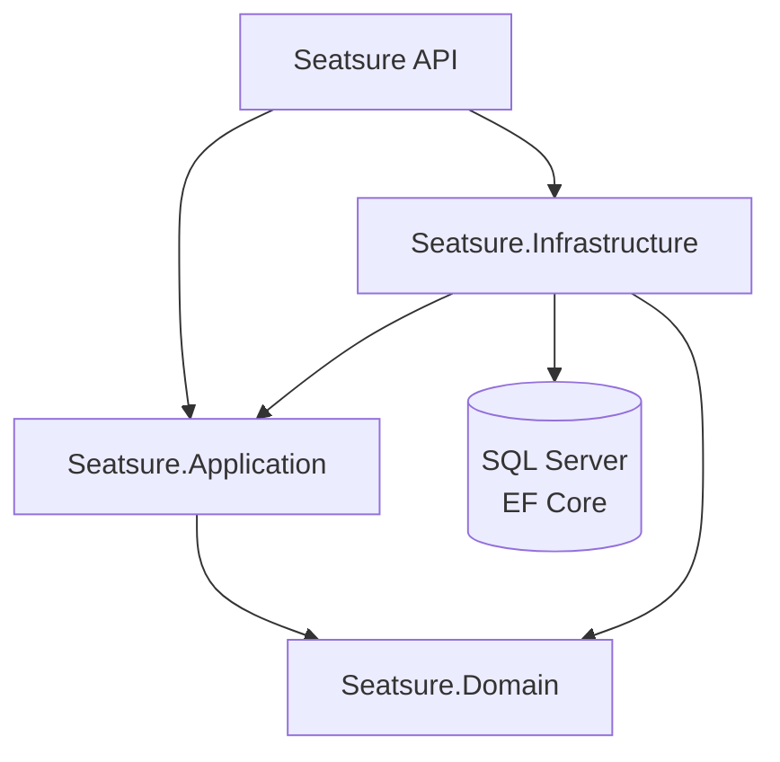
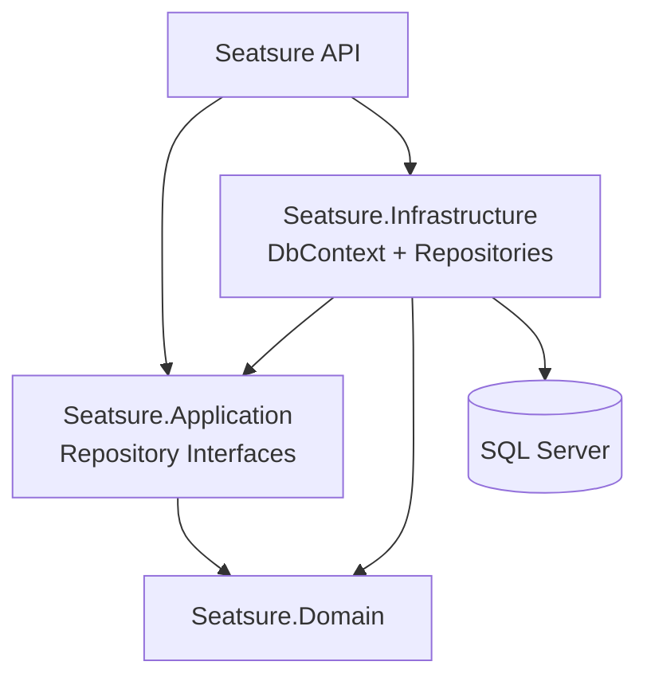

# SeatSure — Clean Architecture & Repository Pattern
## Technical Blueprint

**Tech stack:** ASP.NET Core (.NET 8 LTS), Entity Framework Core, SQL Server, C#.

This version of SeatSure implements the **Repository Pattern using the common Clean Architecture structure**.

---

## 1. Domain Model

### 1.1 Entities

| Entity | Purpose |
|---|---|
| `User` | Represents an attendee or organizer in the system. |
| `Event` | Represents an event owned by an organizer. |
| `TicketType` | Represents a ticket category belonging to an event. |
| `Reservation` | Represents a reservation made by a user for a ticket type. |

---

## 2. Architecture

The project was reorganized from the original BLL/DAL structure into the common Clean Architecture structure:



### 2.1 Domain Layer

The `Seatsure.Domain` project contains the core domain entities and enums used by the application.

The Domain layer does not depend on the Application or Infrastructure layers.

---

### 2.2 Application Layer

The `Seatsure.Application` project contains the repository interfaces (contracts).

```text
Seatsure.Application
└── Interfaces
    ├── IUserRepository.cs
    ├── IEventRepository.cs
    ├── ITicketTypeRepository.cs
    └── IReservationRepository.cs
```

The Application layer references the Domain layer.

The repository interfaces define the required data operations without depending on Entity Framework Core or a specific database implementation.

---

### 2.3 Infrastructure Layer

The `Seatsure.Infrastructure` project contains the database context and repository implementations.

```text
Seatsure.Infrastructure
├── Data
│   └── AppDbContext.cs
└── Repositories
    ├── UserRepository.cs
    ├── EventRepository.cs
    ├── TicketTypeRepository.cs
    └── ReservationRepository.cs
```

The Infrastructure layer references the Application and Domain layers.

`AppDbContext` is responsible for configuring Entity Framework Core and the database entities.

The repository implementations use `AppDbContext` to access the database.

---

### 2.4 API Layer

The `Seatsure` project is the ASP.NET Core Web API.

The API references:

- `Seatsure.Application`
- `Seatsure.Infrastructure`
- `Seatsure.Domain`

Repository implementations are registered through Dependency Injection in `Program.cs`.

---

## 3. Repository Pattern

The Repository Pattern was implemented for the main domain entities.

| Repository Interface | Repository Implementation |
|---|---|
| `IUserRepository` | `UserRepository` |
| `IEventRepository` | `EventRepository` |
| `ITicketTypeRepository` | `TicketTypeRepository` |
| `IReservationRepository` | `ReservationRepository` |

### 3.1 User Repository

`IUserRepository` provides operations for working with users:

- Get user by ID
- Get user by email
- Add a user
- Save changes

Implementation:

```text
Seatsure.Infrastructure/Repositories/UserRepository.cs
```

### 3.2 Event Repository

`IEventRepository` provides operations for working with events:

- Get event by ID
- Get published events with pagination
- Add an event
- Save changes

Implementation:

```text
Seatsure.Infrastructure/Repositories/EventRepository.cs
```

### 3.3 Ticket Type Repository

`ITicketTypeRepository` provides operations for working with ticket types:

- Get ticket type by ID
- Get ticket types by event ID
- Add a ticket type
- Save changes

Implementation:

```text
Seatsure.Infrastructure/Repositories/TicketTypeRepository.cs
```

### 3.4 Reservation Repository

`IReservationRepository` provides operations for working with reservations:

- Get reservation by ID
- Get reservations by user ID
- Get expired reservation holds
- Add a reservation
- Save changes

Implementation:

```text
Seatsure.Infrastructure/Repositories/ReservationRepository.cs
```

---

## 4. Database

Entity Framework Core is used for database access.

The database context is located at:

```text
Seatsure.Infrastructure/Data/AppDbContext.cs
```

`AppDbContext` contains the following `DbSet`s:

- `Users`
- `Events`
- `TicketTypes`
- `Reservations`

### 4.1 Entity Configuration

The `OnModelCreating` method configures:

- Primary keys
- Required properties
- Maximum property lengths
- Unique email index
- Foreign key relationships
- Delete behaviors
- Ticket type concurrency configuration

For example:

- `User.Email` has a unique index.
- `TicketType.RowVersion` is configured as a concurrency token.
- `Event` and `TicketType` relationships are configured with the required foreign keys and delete behaviors.
- `Reservation` relationships are configured with the required foreign keys.

---

## 5. Dependency Injection

Repository implementations are registered in the API's `Program.cs`.

```csharp
builder.Services.AddScoped<IUserRepository, UserRepository>();
builder.Services.AddScoped<IEventRepository, EventRepository>();
builder.Services.AddScoped<ITicketTypeRepository, TicketTypeRepository>();
builder.Services.AddScoped<IReservationRepository, ReservationRepository>();
```

This allows the API to depend on repository interfaces instead of directly depending on their concrete implementations.

---

## 6. Project Structure

```text
Seatsure
│
├── Seatsure
│   ├── Program.cs
│   └── Seatsure.csproj
│
├── Seatsure.Domain
│   └── Seatsure.Domain.csproj
│
├── Seatsure.Application
│   ├── Interfaces
│   │   ├── IUserRepository.cs
│   │   ├── IEventRepository.cs
│   │   ├── ITicketTypeRepository.cs
│   │   └── IReservationRepository.cs
│   └── Seatsure.Application.csproj
│
├── Seatsure.Infrastructure
│   ├── Data
│   │   └── AppDbContext.cs
│   ├── Repositories
│   │   ├── UserRepository.cs
│   │   ├── EventRepository.cs
│   │   ├── TicketTypeRepository.cs
│   │   └── ReservationRepository.cs
│   └── Seatsure.Infrastructure.csproj
│
└── Seatsure.slnx
```

---

## 7. Migration from the Original Structure

The original project structure was:

```text
Seatsure.Domain
Seatsure.BLL
Seatsure.DAL
Seatsure
```

As part of this task:

- `Seatsure.BLL` was removed.
- `Seatsure.DAL` was removed.
- `Seatsure.Application` was created.
- `Seatsure.Infrastructure` was created.
- Repository interfaces were moved to `Application`.
- Repository implementations were moved to `Infrastructure`.
- `AppDbContext` was moved to `Infrastructure`.

The final structure became:

```text
Seatsure.Domain
Seatsure.Application
Seatsure.Infrastructure
Seatsure
```

### 7.1 Repository Interfaces Migration

The repository interfaces were moved from:

```text
Seatsure.DAL/Repositories/Interfaces
```

to:

```text
Seatsure.Application/Interfaces
```

The following interfaces were moved:

```text
IUserRepository.cs
IEventRepository.cs
ITicketTypeRepository.cs
IReservationRepository.cs
```

---

### 7.2 Repository Implementations Migration

The repository implementations were moved from:

```text
Seatsure.DAL/Repositories/Imp
```

to:

```text
Seatsure.Infrastructure/Repositories
```

The following implementations were moved:

```text
UserRepository.cs
EventRepository.cs
TicketTypeRepository.cs
ReservationRepository.cs
```

---

### 7.3 DbContext Migration

The database context was moved from:

```text
Seatsure.DAL/AppDbContext.cs
```

to:

```text
Seatsure.Infrastructure/Data/AppDbContext.cs
```

The `AppDbContext` remains responsible for Entity Framework Core database configuration and entity relationships.

---

## 8. Project References

The project dependencies follow the Clean Architecture structure:

```text
Seatsure.Application
        ↓
Seatsure.Domain

Seatsure.Infrastructure
        ↓
Seatsure.Application
        ↓
Seatsure.Domain

Seatsure API
        ↓
Seatsure.Application
        ↓
Seatsure.Infrastructure
        ↓
Seatsure.Domain
```

This keeps the Domain layer independent from database and infrastructure concerns.

The main dependency rule is:

```text
Domain
  ↑
Application
  ↑
Infrastructure
  ↑
API
```

The Domain layer does not reference any outer layer.

---

## 9. Clean Architecture Responsibilities

### Domain

Responsible for:

- Entities
- Enums
- Core domain concepts
- Domain rules

The Domain layer should remain independent from external technologies.

### Application

Responsible for:

- Repository interfaces
- Application-level contracts
- Abstractions required by the application

The Application layer does not contain Entity Framework Core implementations.

### Infrastructure

Responsible for:

- Entity Framework Core
- `AppDbContext`
- Repository implementations
- SQL Server database access

### API

Responsible for:

- HTTP endpoints
- Controllers
- Dependency Injection
- Swagger/OpenAPI
- HTTP request and response handling

---

## 10. Repository Responsibilities

Each repository is responsible for handling data access for a specific entity.

### UserRepository

Uses `AppDbContext.Users` to:

- Find users by ID
- Find users by email
- Add users
- Save changes

### EventRepository

Uses `AppDbContext.Events` to:

- Find events by ID
- Include related ticket types
- Retrieve published events
- Apply pagination
- Add events
- Save changes

### TicketTypeRepository

Uses `AppDbContext.TicketTypes` to:

- Find ticket types by ID
- Retrieve ticket types for an event
- Add ticket types
- Save changes

### ReservationRepository

Uses `AppDbContext.Reservations` to:

- Find reservations by ID
- Include related ticket types
- Retrieve reservations for a user
- Retrieve expired pending holds
- Add reservations
- Save changes

---

## 11. Entity Framework Core

The Infrastructure project uses Entity Framework Core.

Packages used include:

```text
Microsoft.EntityFrameworkCore
Microsoft.EntityFrameworkCore.SqlServer
Microsoft.EntityFrameworkCore.Design
```

The database provider is SQL Server.

The connection string is configured through the API configuration and used by `Program.cs`:

```csharp
builder.Services.AddDbContext<AppDbContext>(options =>
    options.UseSqlServer(
        builder.Configuration.GetConnectionString("DefaultConnection")));
```

---

## 12. Dependency Injection Flow

At application startup, the API registers the database context and repositories.

```text
Program.cs
    │
    ├── AppDbContext
    │
    ├── IUserRepository → UserRepository
    │
    ├── IEventRepository → EventRepository
    │
    ├── ITicketTypeRepository → TicketTypeRepository
    │
    └── IReservationRepository → ReservationRepository
```

When a repository interface is requested, ASP.NET Core Dependency Injection provides the corresponding Infrastructure implementation.

For example:

```text
IUserRepository
      ↓
UserRepository
      ↓
AppDbContext
      ↓
SQL Server
```

---

## 13. Benefits of the New Architecture

The Clean Architecture structure provides:

### Separation of Concerns

Each project has a specific responsibility.

### Loose Coupling

The Application layer depends on repository abstractions instead of database implementations.

### Maintainability

Database-related code is isolated inside the Infrastructure layer.

### Testability

Repository interfaces can be mocked or replaced during testing.

### Scalability

Additional infrastructure implementations can be introduced without changing the Domain layer.

### Clear Project Organization

The architecture makes it easier to understand where new code should be placed.

---

## 14. Before vs After

### Before

```text
Seatsure API
    │
    ├── BLL
    │
    └── DAL
         └── Entity Framework Core
```

### After

```text
Seatsure API
    │
    ├── Application
    │     └── Repository Interfaces
    │
    └── Infrastructure
          ├── AppDbContext
          └── Repository Implementations

Application
    │
    └── Domain
```

---

## 15. Task Requirements

The task required implementing the Repository Pattern using the common Clean Architecture structure.

The required structure was:

```text
Domain
Application
Infrastructure
API
```

The implementation includes:

- Creating the `Seatsure.Application` project.
- Creating the `Seatsure.Infrastructure` project.
- Moving repository interfaces to the Application layer.
- Moving repository implementations to the Infrastructure layer.
- Moving `AppDbContext` to the Infrastructure layer.
- Adding the required project references.
- Adding Entity Framework Core packages to Infrastructure.
- Registering repositories using Dependency Injection.
- Removing the previous BLL and DAL projects.
- Verifying that the complete solution builds successfully.

---

## 16. Technologies

- .NET 8
- ASP.NET Core
- Entity Framework Core 8
- SQL Server
- C#
- Swagger / OpenAPI

---

## 17. Build Verification

The solution was verified using:

```bash
dotnet build
```

Build result:

```text
Restore complete

Seatsure.Domain succeeded
Seatsure.Application succeeded
Seatsure.Infrastructure succeeded
Seatsure succeeded

Build succeeded
```

All four projects build successfully without compilation errors.

---

## 18. Final Architecture

The final SeatSure architecture is:



The final solution follows the common Clean Architecture structure and implements the Repository Pattern by keeping repository abstractions in the Application layer and their Entity Framework Core implementations in the Infrastructure layer.

---

## 19. Conclusion

SeatSure was reorganized from the original BLL/DAL architecture into a cleaner and more maintainable structure based on Clean Architecture.

The final solution separates:

- **Domain** — core business entities and concepts.
- **Application** — repository abstractions.
- **Infrastructure** — database access and repository implementations.
- **API** — HTTP endpoints and application configuration.

The Repository Pattern is now implemented independently from the API layer, while Entity Framework Core and SQL Server remain isolated within the Infrastructure layer.

The solution successfully builds with:

```bash
dotnet build
```

and all projects compile successfully.
